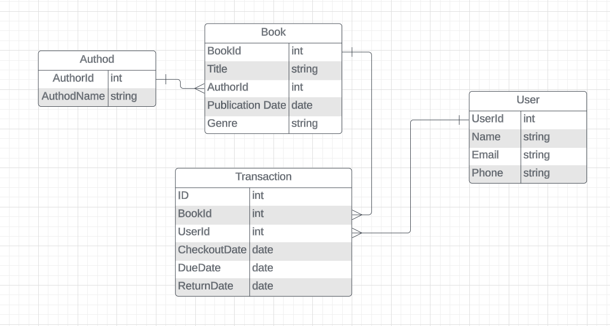

# LibrarianX - A Library Management API

## Overview
LibrarianX is a simple Library Management API built using ASP.NET Core. As a beginner in the world of web development and APIs, I embarked on this project as part of my learning journey with ASP.NET Core. The goal was to gain hands-on experience in designing and implementing RESTful APIs.

## Features
- Book Management: Add, edit, and delete books with ease.
- User Management: Keep track of library members.
- Transaction Management: Keep track of transactions of book by users.

## Technologies Used
- ASP.NET Core: The framework for building the API.
- Entity Framework Core: For database operations.
- Swagger: Interactive API documentation.
- SQL Server: Backend database for storing library information.

## Database Schema

## API Endpoints
### Book
- GET /api/books: Retrieve a list of all books.
- GET /api/books/{id}: Get details of a specific book.
- POST /api/books: Add a new book to the library.
- PUT /api/books/{id}: Update information for a specific book.
- DELETE /api/books/{id}: Delete a book from the library.

### Author
- GET /api/authors: Retrieve a list of all authors.
- GET /api/authors/{id}: Get details of a specific author.
- POST /api/authors: Add a new author.
- PUT /api/authors/{id}: Update information for a specific author.
- DELETE /api/authors/{id}: Delete a author.

### User
- GET /api/users: Retrieve a list of all users.
- GET /api/users/{id}: Get details of a specific user.
- POST /api/users: Add a new user.
- PUT /api/users/{id}: Update information for a specific user.
- DELETE /api/users/{id}: Delete a user from the library.

### Transaction
- GET /api/transactions: Retrieve a list of all transactions.
- GET /api/transactions/{id}: Get details of a specific transaction.
- GET /api/transactions/user/{id}: Get transactions of a specific user.
- GET /api/transactions/due: Get transactions for which due date is over.
- POST /api/transactions: Add a new transaction.
- PUT /api/transactions/{id}: Update information for a specific transaction.
- DELETE /api/transactions/{id}: Delete a transaction.

## Getting Started
- Clone this repository: git clone https://github.com/wajiul/LibrarianX.git
- Navigate to the project folder: cd LibrarianX
- Install dependencies: dotnet restore
- Run the application: dotnet run

Feel free to explore, contribute, or provide feedback. This project is a testament to my learning journey, and I hope it serves as a resource for others diving into ASP.NET Core API development.

Happy coding!
